# DevOps Learning

A hands-on DevOps learning repository for a full-stack developer working with **Java, Spring Boot, Next.js, PostgreSQL, Docker, and GitHub**.

## Purpose of this repository

The purpose is not to change from a Java developer into a full-time DevOps engineer.

The purpose is to become a stronger full-stack Java developer who can understand and manage the complete life of an application:

```text
Idea -> Code -> Test -> Build -> Package -> Deploy -> Monitor -> Improve
```

As a full-stack Java developer, writing backend and frontend code is only one part of delivering software. A feature has no value to users until it can be built reliably, configured safely, deployed, observed, and recovered when something fails.

Read the detailed explanation: [`docs/WHY-DEVOPS-FOR-FULLSTACK-JAVA.md`](docs/WHY-DEVOPS-FOR-FULLSTACK-JAVA.md).

## Why learn DevOps as a full-stack Java developer?

DevOps knowledge helps you:

- Run Spring Boot, Next.js, and PostgreSQL consistently on different machines.
- understand why an application works locally but fails on a server.
- automate tests and builds instead of repeating manual steps.
- deploy releases safely and roll back broken versions.
- manage environment variables and secrets correctly.
- diagnose problems using logs, metrics, health checks, ports, and processes.
- communicate better with infrastructure, cloud, security, and operations teams.
- take responsibility for a feature from development to production.

## Application delivery flow

```mermaid
flowchart LR
    A[Plan feature] --> B[Develop Next.js UI]
    B --> C[Develop Spring Boot API]
    C --> D[Store data in PostgreSQL]
    D --> E[Commit and open pull request]
    E --> F[CI: lint, test, build]
    F --> G[Build Docker images]
    G --> H[Push images to registry]
    H --> I[Deploy through Nginx]
    I --> J[Users access application]
    J --> K[Logs, metrics, health checks]
    K --> L[Fix and improve]
    L --> A
```



## What DevOps adds to your current stack

| Your development skill | DevOps skill that completes it | Result |
|---|---|---|
| Spring Boot API | Linux, Docker, health checks, logs | Backend runs reliably outside IntelliJ |
| Next.js frontend | Node build, Docker, Nginx, caching | Frontend can be built and served consistently |
| PostgreSQL | Volumes, backup, restore, networking | Data survives deployments and failures |
| Git and GitHub | Branches, pull requests, CI/CD | Changes are tested and delivered safely |
| Application configuration | Environment variables and secrets | Dev, test, and production remain separated |
| Debugging code | Monitoring and incident diagnosis | You can find production problems faster |

## Goal

Learn how to move an application through this complete flow:

```text
Code -> Test -> Build -> Package -> Deploy -> Observe -> Improve
```

This repository is not only a note archive. Every topic should include:

1. A short explanation in your own words
2. Commands you actually used
3. A small working lab
4. Errors, causes, and fixes
5. A clear completion check

## Start here

1. Read [`docs/WHY-DEVOPS-FOR-FULLSTACK-JAVA.md`](docs/WHY-DEVOPS-FOR-FULLSTACK-JAVA.md).
2. Read [`ROADMAP.md`](ROADMAP.md).
3. Start with [`labs/01-docker-basics/README.md`](labs/01-docker-basics/README.md).
4. Record each study session with [`templates/daily-note.md`](templates/daily-note.md).
5. Record each practical exercise with [`templates/lab-report.md`](templates/lab-report.md).
6. Commit small, meaningful changes after every completed lab.

## Learning order

| Stage | Topic | Practical result |
|---|---|---|
| 1 | Linux, terminal, networking, Git | Diagnose processes, ports, permissions, and HTTP problems |
| 2 | Docker fundamentals | Build and run a container confidently |
| 3 | Docker Compose | Run Spring Boot, Next.js, and PostgreSQL together |
| 4 | CI with GitHub Actions | Automatically test and build pull requests |
| 5 | Deployment | Deploy a containerized application behind Nginx with HTTPS |
| 6 | Observability | Collect logs, metrics, health checks, and alerts |
| 7 | Infrastructure as Code | Provision infrastructure using Terraform |
| 8 | Kubernetes | Deploy and manage the application on a local cluster |

## Repository structure

```text
devops-learning/
├── README.md
├── ROADMAP.md
├── docs/
│   └── WHY-DEVOPS-FOR-FULLSTACK-JAVA.md
├── notes/
├── labs/
├── templates/
└── elasticsearch/     # Existing advanced/legacy observability experiment
```

## Study rules

- Learn one concept, then immediately use it.
- Do not copy commands without explaining what they do.
- Never commit passwords, API keys, private keys, `.env` files, or cloud credentials.
- Prefer one complete project over many unfinished tutorials.
- Do not start Kubernetes until Docker Compose and CI/CD feel comfortable.
- Use pull requests for meaningful changes, even when working alone.

## Recommended capstone

Containerize and deploy a full-stack system containing:

- Next.js frontend
- Spring Boot REST API
- PostgreSQL
- Nginx reverse proxy
- GitHub Actions CI/CD
- Health checks and logs
- Terraform infrastructure
- Kubernetes manifests as the final stage

## Current status

- [x] Existing Docker/Elastic Stack experiment
- [ ] Stage 1: Foundations
- [ ] Stage 2: Docker
- [ ] Stage 3: Docker Compose full-stack lab
- [ ] Stage 4: GitHub Actions CI
- [ ] Stage 5: Deployment
- [ ] Stage 6: Observability
- [ ] Stage 7: Terraform
- [ ] Stage 8: Kubernetes
