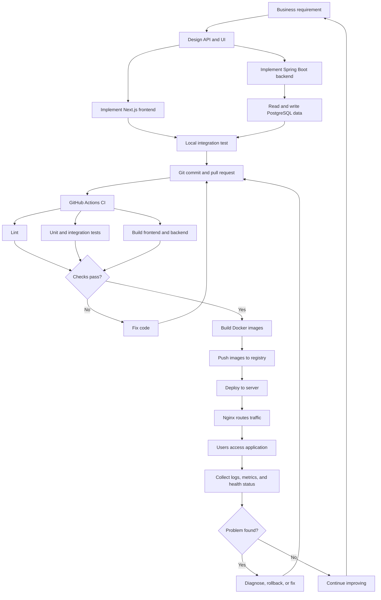
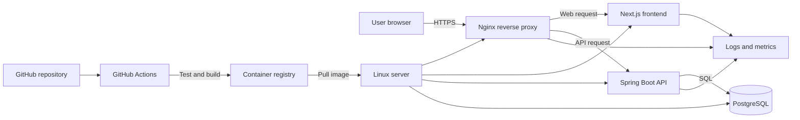
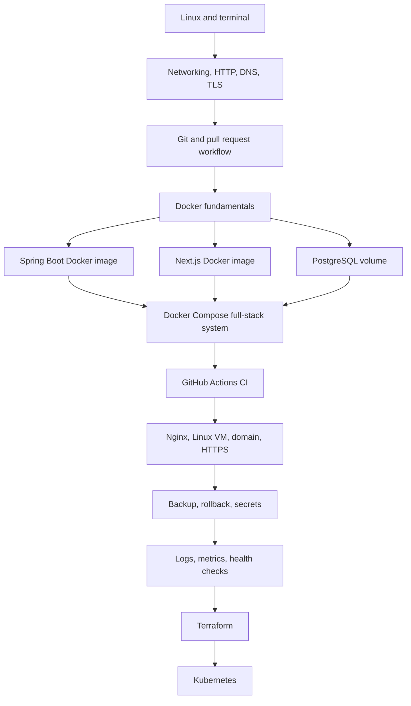

# Why DevOps Matters for a Full-Stack Java Developer

## 1. Main purpose

You are learning DevOps to become a developer who can deliver a complete working system, not only write application code.

A full-stack Java developer should understand how a feature moves from an idea on a laptop into a reliable service used by real users.

```text
Developer responsibility before DevOps:
Write code -> Run locally -> Send to someone else

Developer responsibility with DevOps knowledge:
Plan -> Build -> Test -> Package -> Deploy -> Observe -> Recover -> Improve
```

This does not mean you must become a Kubernetes expert or cloud architect immediately. It means you should know enough infrastructure and delivery work to own your application confidently.

## 2. The problem DevOps solves

Without DevOps knowledge, developers often face these problems:

- The application works in IntelliJ but fails on another computer.
- The frontend, backend, and database require many manual setup steps.
- Environment variables are different or missing.
- A release is deployed manually and causes downtime.
- A broken release cannot be rolled back quickly.
- Nobody knows which process is using a port.
- Logs are difficult to find.
- Database data is lost when a container is removed.
- Tests are forgotten before merging code.
- Production problems are passed to another team without enough information.

DevOps practices reduce these problems through repeatable environments, automation, monitoring, documentation, and shared ownership.

## 3. Your target role

Your target is:

> Full-stack Java developer with strong delivery and operational skills.

That means you can:

- build a Spring Boot API;
- build a Next.js interface;
- design and query PostgreSQL;
- package services with Docker;
- run the complete system with Docker Compose;
- automate validation with GitHub Actions;
- deploy through Nginx to a Linux server;
- configure DNS and HTTPS;
- protect secrets;
- monitor health, logs, and metrics;
- back up and restore data;
- provision simple infrastructure with Terraform;
- understand Kubernetes after mastering the earlier stages.

## 4. How a feature reaches production



## 5. How the system fits together



## 6. What each DevOps topic gives you

### Linux

Why learn it:

Most production servers run Linux. Containers also use Linux concepts.

Use it to:

- inspect files and permissions;
- manage processes and services;
- read application logs;
- check CPU, memory, and disk usage;
- connect to a remote server using SSH;
- troubleshoot ports and environment variables.

Java example:

```text
Spring Boot cannot start because port 8080 is busy.
Linux knowledge helps you find and stop the process safely.
```

### Networking and HTTP

Why learn it:

Your frontend, backend, database, proxy, browser, and cloud server communicate through networks.

Use it to understand:

- IP addresses and ports;
- DNS;
- HTTP requests and responses;
- HTTPS and TLS;
- reverse proxies;
- firewalls and security groups;
- why `localhost` behaves differently inside containers.

Java example:

```text
Next.js calls Spring Boot successfully locally but fails after deployment.
Networking knowledge helps you check the URL, port, DNS, proxy, and firewall.
```

### Git and pull requests

Why learn it:

DevOps starts with a safe and traceable code-delivery process.

Use it to:

- isolate work with branches;
- review changes;
- trigger CI pipelines;
- tag releases;
- restore previous versions;
- connect code changes to deployments.

### Docker

Why learn it:

Docker packages the application and its runtime requirements into a repeatable image.

Use it to:

- run Spring Boot without depending on a developer's local JDK setup;
- build consistent development and production environments;
- package Next.js and Nginx;
- control ports, files, variables, and startup commands;
- share the same application image between machines.

Java example:

```text
Instead of saying "install Java 21, copy the JAR, and run this command,"
you provide one tested image that runs consistently.
```

### Docker Compose

Why learn it:

A real full-stack project has multiple services.

Use it to run:

```text
Next.js + Spring Boot + PostgreSQL + Nginx
```

with one command:

```bash
docker compose up --build
```

This is one of the most important stages for your current skill level.

### CI/CD with GitHub Actions

Why learn it:

Humans forget manual steps. Automation repeats them consistently.

Use CI to:

- run frontend linting;
- run Spring Boot tests;
- build the JAR;
- build Next.js;
- build Docker images;
- block broken pull requests.

Use CD later to:

- publish versioned images;
- deploy approved changes;
- run database migration steps carefully;
- verify health after deployment;
- roll back when necessary.

### Nginx, DNS, and HTTPS

Why learn them:

Users should access one secure domain instead of many internal ports.

Use Nginx to:

- serve or proxy the Next.js frontend;
- forward `/api` requests to Spring Boot;
- terminate HTTPS;
- hide internal service ports;
- add headers and basic traffic controls.

Example:

```text
https://app.example.com       -> Next.js
https://app.example.com/api   -> Spring Boot
```

### Observability

Why learn it:

A successful deployment does not guarantee a healthy application.

Use observability to answer:

- Is the service running?
- Are requests slow?
- Are errors increasing?
- Is memory usage too high?
- Which request caused the failure?
- Is PostgreSQL reachable?

Start with:

1. Spring Boot Actuator
2. container logs
3. structured logs and request IDs
4. Prometheus and Grafana
5. centralized logging
6. tracing

### Terraform

Why learn it:

Manual cloud setup is difficult to reproduce and review.

Use Terraform to define infrastructure as code:

- server;
- network;
- firewall rules;
- database;
- storage;
- outputs and variables.

Learn it only after manually deploying one simple application so you understand what the code is creating.

### Kubernetes

Why learn it later:

Kubernetes manages containers across a cluster, but it adds many new concepts.

Use it for:

- replicas;
- rolling deployments;
- service discovery;
- self-healing;
- configuration;
- resource limits;
- larger container platforms.

Do not begin here. First become comfortable with Linux, networking, Docker, Compose, CI/CD, and one Linux server deployment.

## 7. Recommended learning flow for you



## 8. What to build while learning

Use one real project instead of unrelated tutorials.

Recommended capstone:

```text
Next.js frontend
Spring Boot REST API
PostgreSQL database
Nginx reverse proxy
Docker and Docker Compose
GitHub Actions
Linux server deployment
HTTPS
Health checks and monitoring
Terraform
Kubernetes as the final version
```

Suggested milestones:

1. Run Nginx in Docker.
2. Build your own Nginx image.
3. Containerize one Spring Boot application.
4. Add PostgreSQL with persistent storage.
5. Containerize Next.js.
6. connect all services using Docker Compose.
7. Add automated tests and builds.
8. deploy to one Linux VM.
9. configure a domain and HTTPS.
10. add health checks, logs, and metrics.
11. practise backup and rollback.
12. recreate infrastructure with Terraform.
13. deploy a later version to Kubernetes.

## 9. Your responsibility after learning

You should be able to answer these questions about your application:

- How is it built?
- Which Java and Node versions does it require?
- Which ports does it use?
- How does the frontend find the backend?
- How does the backend find PostgreSQL?
- Where are secrets stored?
- What happens when a test fails?
- How is a release deployed?
- How can it be rolled back?
- Where are the logs?
- How do you know it is healthy?
- How is the database backed up?
- How can a new developer run the project?

## 10. Definition of success

You have reached the main goal when a new developer can clone your project and run the complete stack with documented commands, while your CI pipeline validates changes and your deployed system can be monitored and recovered safely.

The strongest result is not memorizing many tools. It is being able to explain and operate the complete path from source code to a healthy production application.
